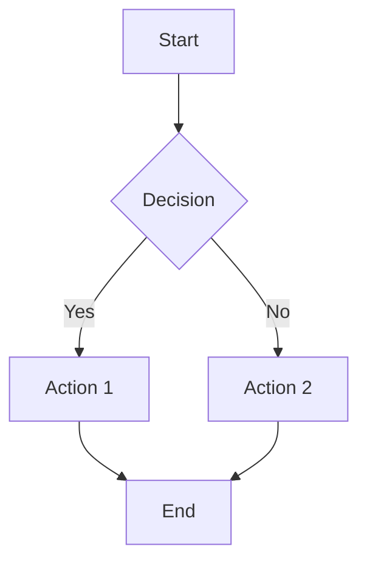

---
tags:
  - Imported/me
---
This is your new *vault*.

Make a note of something, [[create a link]], or try [the Importer](https://help.obsidian.md/Plugins/Importer)! ^prev

When you're ready, delete this note and make the vault your own.

# Markdown Tutorial:
If you open this file in a plain text editor, you will see quite a few back-ticks in this section, enclosing the characters which have been rendered as `monospace`.
This will allow the `*raw* [[syntax]]` to show up in rendered view.
### Links
In the [[#^prev|previous section]] were examples of `[[internal]]` and `[external](links)`. As you may have already seen, these follow the format `[[filename|display name]]` and `[display text](URL)`, respectively.
>[!info]- Backlinks and Outgoing links
>Use the keyboard shortcut `Alt-[`, and a list of all the links in this document will appear on your right.
>Notice the icons which indicate which linked files haven't been created yet, and the icon for a [[#^prev|block identifier]], described [[#Embeds and Transclusions|in the next section]], as well as the `H` icon for headings.
>The coolest part about `[[internal links]]` in Obsidian is that they are **bi-directional**. Use the keyboard shortcut `Alt-]` to pull up the list of all the links pointing to this note (there aren't any, but you can create one).

Internal links are what make up all the branches in the Graph view.
### Embeds and Transclusions
The same syntax is used for transcluding other files into a note. This can be used for any file type supported by Obsidian, which includes:
- Markdown files `.md`
- Most image types:
	- `.jpg`
	- `.png`
	- `.gif`
	- ...and maybe a few others
- Audio and video files:
	- `.wav`
	- `.ogg` vorbis
	- `.m4a`
	- `.mp4`
	- Maybe `.mov`, depending on the phase of the moon.
- `.pdf`
- Obsidian Bases `.base`
- JSON canvas files `.canvas`, though these will show only the outlines, so it's generally better to link them.

As an example, here is an image included in the body of a note:
[[Gemini_Generated_Image_keiev8keiev8keie.png|480]]
This is done by preceding the link syntax with an exclamation point:
`![[filename.png|width]]`
You can also embed the text of other notes the same way using block identifiers (like the one [[#^prev|near the beginning of this document]]!).
>[!example]+ It looks like this:
>![[Classes I've Taken#Spring 2026]]
>And the syntax looks like this:
>`![[filename#heading]]` or `![[filename#^block-id]]`
### Formatting
Speaking of format, you've probably noticed the headings and bulleted lists in this document. This type of formatting is helpful because it gives your document structure. You can create a new heading by beginning a new line with 1-6 `#hash` signs (though you probably already knew that), and you can see a list of all the headings in the currently open note by clicking on the `Outline` button (which I've moved between the `Backlinks` and the `Bookmarks` buttons in the toolbar, by you can reposition it wherever you want). The number of hash signs specifies level of heading and creates hierarchy. As you may have already seen earlier, to create a bulleted list, begin a new line with a hyphen followed by a space, like this:
`- list item`
You can also create numbered lists, like this memorable one from the fourth [article of faith](https://www.churchofjesuschrist.org/study/scriptures/pgp/a-of-f/1?lang=eng):
1) Faith in the Lord Jesus Christ
2) Repentance
3) Baptism by immersion for the remission of sins
4) The laying on of hands for the Gift of the Holy Ghost
5) ...and enduring to The End.

Using the `Tab` key, you can create multilevel lists, like the list of supported file types in [[#Embeds and Transclusions|this earlier section]]. Obsidian also includes out-of-the-box the ability to collapse headings and multilevel lists.
#### Task lists
Here's where things get really exciting. Obsidian is one of the few knowledge-management software platforms that allows (but does not include) support for multi-state checklists. [Steph Ango](https://stephango.com/), the CEO of Obsidian, also created [this theme](https://stephango.com/minimal) (which I've already installed for your convenience), which includes the following checkbox states:
- [ ] Not Started
- [/] Incomplete
- [x] Complete
- [-] Cancelled
- [>] Postponed or Delegated
- [<] Rescheduled
- [b] Bookmark
- [u] Increase
- [d] Decrease
- [p] Like
- [c] Dislike
- [f] Fire
- [l] Place
- [w] Win
- [S] Anything monetary
- [?] Uncertain
- [i] Info
- ["] Quote
- [!] Important
- [I] Inspiration
- [*] Star

Don't forget, this is a `plain text` file at heart, so you can use `source mode` or a text editor of your choice to see the raw syntax used to create these checkboxes.
#### **Bold**, *Italic*, <u>Underline</u>, etc.
The same keyboard shortcuts used for **Bold** (`Ctrl-B`) and *Italic* (`Ctrl-I`), also work in Obsidian; though <u>Underline</u> does not, probably because there is no agreed-upon standard markdown syntax for <u>underlining</u> besides the `<u>HTML tag pairs</u>`. There *is* Obsidian-supported standard markdown syntax for ~~crossing words out~~ or ==highlighting== them, though.
#### Block-quotes and Callouts
You might be wondering how I made those colored boxes [[#Links|seen earlier]] (unless, of course, you looked at the raw syntax). Since you're obviously *not* wondering that, I just wanted an excuse to demonstrate what a markdown blockquote looks like in Obsidian, while also demonstrating an example of another type of Obsidian callout:
>As you may know, "dudgeon" is a word that describes feeling cross, and to be in high dudgeon means feeling very cross indeed. (Do not bee one of those careless speakers who says "dudgeon" when they mean "dungeon". Being locked in a dungeon might well cause a person to be in high dudgeon, but that is the only real connection between the two)

>[!cite] A fit of pique encounters a bit of pluck[^1]
>Wood, Maryrose. "The Hidden Gallery". *The Incorrigible Children of Ashton Place*. Vol. 2 Ch. 1 (Page 2 par 1). 2011. HarperCollins Publishers. 2015
#### Codeblocks and Equations
Markdown has become an industry standard for writing code documentation, and as such, many markdown editors (including Obsidian) have included syntax highlighting capabilities. Codeblocks are delineated using sets of three backticks, like in this example of a factorial function written in python:
```python
def factorial(n):
	if n <= 0:
		return 1
	else:
		return n * factorial(n-1)
# Hopefully we reach the base case at some point so the function dosen't call itself forever.
```
Most common programming languages are supported by this feature. There are also specialized codeblocks using the same delimiters that are rendered by Obsidian, which include:
- `query` (embeds search results into a note)
- `mermaid` (for creating charts)
- `dataview` (only if you have the [DataView plugin](obsidian://show-plugin?id=dataview) installed, otherwise renders as any other codeblock)
Here are examples of the first two:
```query
["for":college]
```
***

Since you'll probably be taking a number of math classes this semester, you'll probably want to learn how to use LaTeX syntax to write math equations. I'll start by showing an example:
$$\begin{bmatrix}2 & 1 & -7\\
-2 & -3 & 5\\
1 & 2 & 4\end{bmatrix} * \int \ln(t)\hat{i} + (3t - 7t^2)\hat{j} + \cos(t)\hat{k} \, dt $$
Bookending the syntax `$with dollar signs$` can be used to write $\frac{x-\mu}{\sigma}$ inline math expressions.
>[!tip] By the way...
>I think now might be a good time to mention that a `\backslash` can by used outside pairs of dollar signs as an escape character, which can be helpful when you want to write 90\% or \$14,000,605 without accidentally rendering something that shouldn't be rendered.
### Comments and %%invisibility%%
Now that I've mentioned percent signs and included an example of a comment in code, I figured you might like to know how to comment phrases out that you don't want to appear when you either export a note as a pdf (something Obsidian is also equipped to do, in most cases) or turn on Reader view. There are two ways of doing this:
1) Obsidian's way, using `%%double percent signs%%`, which %%keeps *most* formatting intact, (which can be helpful when you [[create a link]] inside a comment, but%% is usually kept visible in other markdown editors.
2) Using `<!--HTML comments-->`, which is supported by several markdown editors, but all the formatting inside is rendered (only in editing mode) as raw syntax.

Also, another standardized markdown feature that I've been finding very useful is footnotes. These can be created by typing `[^2]`, and at this point, Obsidian steps in with an empty text field and takes care of the rest.
## But wait, there's more!
We can get into all that later, when we have time.
Because of Obsidian's expand ability, there is no limit to how deep you can go.

[^1]: Unfortunately, this Callout-within-a-blockquote did not render as I had hoped. Oh well, at least you can see the syntax.
