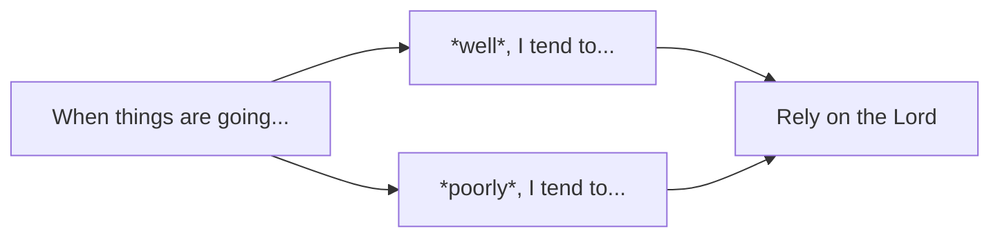

1. <progress max="10", value="1"></progress> My birthday
2. <progress max="10" value="9"></progress> Breakfast last Saturday
3. <progress max="10" value="8.5"></progress>
4. <progress max="10" value="6"></progress> Where I put my keys
5. <progress max="10" value="5.5"></progress> What I learned in school
## Complete the following statements
- When things are going *well* in my life, I tend to:
- When things are going *poorly* in my life, I tend to:
#### Hopefully these answers eventually will be the same
